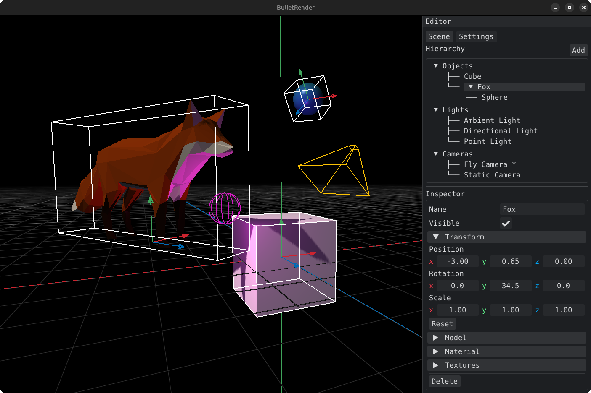

<p align="center">
    
</p>

Small but complete C/C++ and OpenGL 3D graphics engine. It works as a standalone graphics library that can be plugged into any project that needs rendering, this way it serves as a submodule of the game engine. It can also be used independently as a standalone editor tool.

<p align="center">
    
</p>

## Features

- **Scene** owns models, lights and cameras, objects form parent-child hierarchy with local and world transforms
- **Rendering** through configurable passes, base pass draws geometry with phong shading, pre and post passes (grid, world axis, skybox, fog)
- **Lighting** with ambient, directional, point and spot sources, directional and spot ones cast shadows through shadow maps
- **Cameras** of three kinds, static one looks at target, fly one moves with WASD and mouse, orbit one rotates around point
- **Materials** carry phong terms and named texture slots, values not set fall back to what came with the model
- **Models** load from obj with materials and textures, or come from built-in primitives
- **Debug view** draws gizmos for transforms, lights, cameras and object bounds
- **Editor** gives side panel with scene hierarchy, inspector and settings, everything in scene is created and edited at runtime

## Dependencies

System libraries, expected to be installed:

- **OpenGL**
- **GLFW**
- **GLM**

Bundled in `external/`:

- **glad** for OpenGL loading
- **Dear ImGui** for interfaces
- **tinyobjloader** for obj parsing
- **stb_image** for texture loading

## Structure

```
src/
├── app/          window and main loop
├── scene/        scene, objects, cameras, lights
├── render/       renderer, passes, materials, textures
├── interface/    editor (only in standalone build)
└── utils/
```
